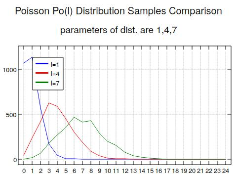
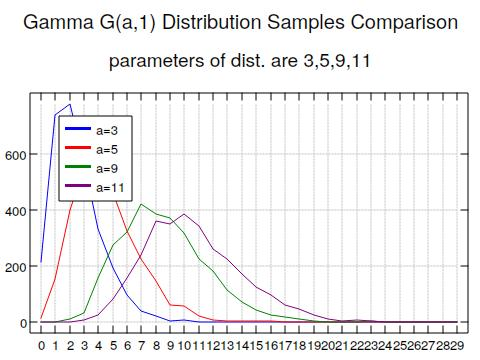
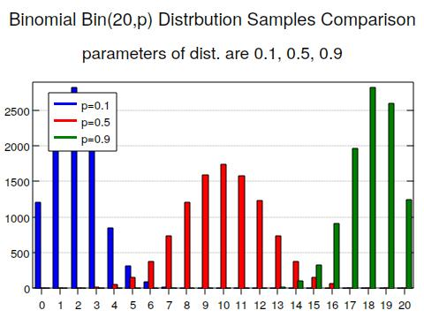
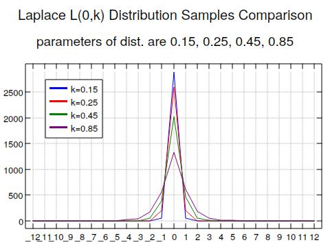
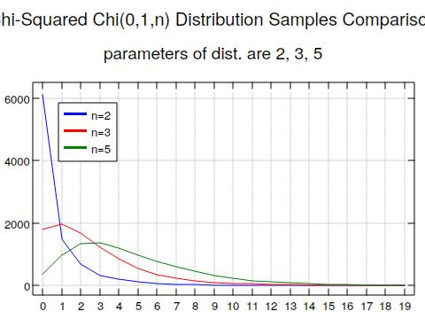

# Statistical Sampling

Some sampling methods for various discrete and continuous random variables.


| distribution | params | notes |
|--------------|--------|-------|
| uniform      |   -    |       |
| binomial     | n,p    |       |
| neg. binomial | r,p    |       |
| cauchy       | center,scale       |       |
| exponential  | k       |       |
| laplace      | center,scale       |       |
| poisson      | mean       |       |
| normal       | mean, std. dev       |       |
| gamma        | shape, rate       |       |
| beta         | shape       |       |
| dirichlet        | alphas       |       |
| chi-squared  | center,spread |      |

## Uniform (Continuous)

```j
NB. 10 i.i.d. uniform samples taken from U(0,1) distribution.
uniformSample 10
```

## Normal / Gaussian

```j
NB. 10 random variables independently sampled from a N(2.5,6.4) 
NB. normal distribution.
normalSample 2.5 6.4 10
```

## Exponential

```j
NB. 1000 random variables independently sampled from an
NB. exp(10) distribution.
exponentialSample 10 1000
```

## Poisson

```j
NB. 1000 random variables independently sampled from a 
NB. Po(2.222) poisson distribution.
exponentialSample 2.222 1000
```
### Some examples


## Cauchy

```j
NB. 200 random variabled independently sampled from a Cauchy(0,1)
NB. distribution.
cauchySample 0 1 200
```


## Gamma
NB. 4000 random variables independently sampled from a
NB. Gamma(4.6,1) gamma distribution.
```j
gammaSample 4.6 1 4000 
```
### Some examples


## Beta
```j
NB. 1000 random variables independently sampled from a
NB. Beta(2,4) beta distribution.
betaSample 2 4 4000 
```

## Binomial
```j
NB. 100 random variables independently sampled from a
NB. Bin(10,0.4) binomial distribution.
binomialSample 10 0.4 100 
```
### Some examples


## Negative Binomial
```j
NB. 100 random variables independently sampled from a
NB. NegBin(10,0.4) binomial distribution.
binomialNegSample 10 0.4 100 
```
 
## Dirichlet

```j
NB. 100 random variables independently sampled from a
NB. Dir(0.2, 0.1, 0.99, 0.5, 1.4) dirichlet distribution,
NB. where the parameters are the parameter 'a' of a 
NB. Gamma(a,1) distribution.
dirichletSample 10 0.4 100 
```

## Laplace 
```j
NB. 1000 random variables independently sampled from a
NB. Laplace(0,2) laplace distribution.
laplaceSample 0 2 1000 
```
### Some examples


## Chi-Squared 
```j
NB. 1000 random variables independently sampled from a
NB. ChiSq(0,1,3) chi-squared distribution.
chiSqSample 0 1 3 1000 
```
### Some examples


 